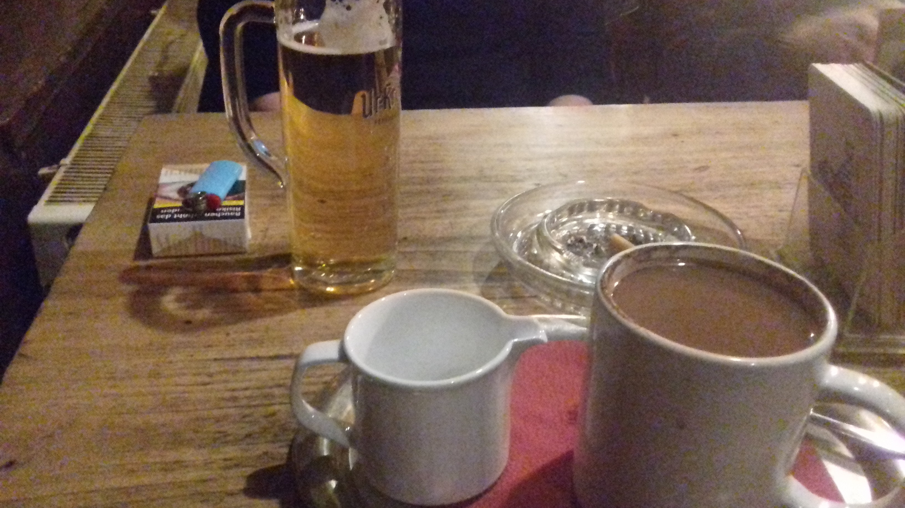

Wir alle hier in der LIBREAS-Redaktion haben auch unsere politischen und
gesellschaftlichen Überzeugungen. Nicht alle die gleichen, aber doch in
der Grundtendenz übereinstimmend: für eine offene Gesellschaft, für
Freiheit, für Demokratie, für Humanismus und Menschenrechte, für eine
soziale und auch ökologische Zukunft. Was in den letzten Jahren
passiert, in der Welt und vor allem im DACH-Raum, mit all den
rassistischen, nationalistischen, autoritären Bewegungen, mit den
Wahlerfolgen rechtsextremer Parteien, dem Mainstreaming von
Anti-Feminismus, der Produktion von Hass, der Ausgrenzung von Menschen,
Verschwörungstheorien, und zuletzt auch noch der Verächtlichmachung
politischer Bewegungen junger Menschen durch, well, "alte weiße Männer",
hat uns -- nicht nur uns -- immer und immer wieder erschreckt, besorgt
und wütend gemacht. Ist die Welt verrückt geworden? Machen vor allem
alte Generationen die Welt, die EU, die Zukunft kaputt?

Was uns in dieser Atmosphäre auch erschreckte, war die Reaktion einiger
Bibliotheken und bibliothekarischer Publikationen. Waren gerade
Öffentliche Bibliotheken kurz vorher aktiver und wahrnehmbarer Teil der
großen Bewegung gewesen, Menschen, die nach Europa geflohen waren,
willkommen zu heißen und ihnen die Integration zu erleichtern, gab es
auf dem Bibliothekstag 2018 in Berlin eine Podiumsdiskussion, die uns
als Kumulation einer anderen Bewegung im Bibliothekswesen erschien. Sie
hinterließ den Eindruck, als ob Teile des Bibliothekswesens den Ernst
der Lage nicht verstanden hätten. In der Diskussion ging es eigentlich
darum, wie mit den Medien neu-rechter Verlage umzugehen sei. Das ist
keine unwichtige Frage, denn diese Medien existieren und stellen die
Grundfesten jeder humanistischen Überzeugung in Frage -- mit alten
rassistischen und nationalistischen Vorstellungen, aber geupdateter
Sprache und Sprachstrategie. Sollten Bibliotheken sich dazu verhalten
und wenn ja wie? Teile des Podiums schienen sich nicht einmal auf die
Veranstaltung vorbereitet zu haben, so als ob es sich um ein
austauschbares Thema handelte. Bei der anschließenden Diskussion wurde
-- vielleicht im Affekt -- teilweise mit dem Argument, das sei halt
Neutralität, für das Einstellen dieser neu-rechten Bücher in den Bestand
geworben mit dem Verweis darauf, im Sinne einer Serviceeinrichtung, dass
es ja eine Nachfrage für diese Literatur gäbe. Kurz nach dem
Bibliothekstag erschienen dann in verschiedenen bibliothekarischen
Publikationen Beiträge, auch hochrangiger Kolleginnen und Kollegen, die
ebenfalls mit dem Argument einer angeblich der Bibliothek eigenen
"Neutralität" die Meinung vertraten, solche Medien müssten neben anderen
-- damit auch solchen, die ihnen widersprechen -- in allen Bibliotheken
eingestellt werden. Es wurde damit auf ein Verständnis von Medien und
Informationen zurückgegriffen, das uns absonderlich apolitisch vorkam --
so, als wäre das alles nur ein Meinungsstreit, bei dem alle Beteiligten
das gleiche Interesse an der Wahrheit hätten, was bekanntlich nicht der
Fall ist, denn es geht hier um Politik, also Gesellschaftsgestaltung,
nicht um die Wahrheit.

Was soll diese "Neutralität" sein? Wieso hatten wir den Eindruck, unter
diesem Begriff wurden vor allem die Medien der neuen Rechten in die
Bestände eingefügt? (Oder gab es solche Diskussionen in den letzten
Jahren um andere Medien? Medien von Minoritäten, feministischen Medien,
Medien anderer politischer Richtungen?) Warum schien uns, als würde mit
diesem "Neutralitäts"-Diskurs vor allem die autoritäre Rechte
unterstützt? Weil das gleiche Spiel in den letzten Jahren in den Medien
zu beachten war, wo unter dem Label der Meinungsfreiheit vor allem die
Meinung eines autoritären Teils der Gesellschaft verstärkt wurde? (Zumal
uns auffiel, wer hier vor allem von "Neutralität" sprach: Kolleginnen
und Kollegen aus der Mehrheitsgesellschaft, gut situiert, abgesichert.
Kolleginnen und Kollegen aus marginalisierten Gruppen hingegen -- zu
denen wir in der Redaktion ehrlich gesagt nicht gehören, auch wenn wir
(noch?) nicht alle gut situiert sind -- schienen dazu nicht zu reden:
Was dachten die sich eigentlich dazu? Oder sprachen vor allem die, die
sich keine Sorgen machen müssen, was passieren könnte, wenn die neue
Rechte die Macht übernimmt, von Neutralität, während andere sich Sorgen
machten?)

Uns ist und war das alles nicht geheuer. Deshalb schrieben wir zu diesem
ominösen Begriff der "Neutralität" -- der auch im Bibliothekswesen eine
Geschichte hat, die aber auch in all den Beiträgen nicht referiert wird
-- einen Schwerpunkt der LIBREAS aus. Wir wollten wissen, ob wir alleine
sind. Wir wollten auch wissen, ob es differenzierte Überlegungen zu
diesem Thema gibt. Hieraus ist die Ausgabe entstanden.

Wir wissen jetzt, aus den Einreichungen zur Ausgabe und auch aus
Reaktionen auf unseren Call for Papers, dass wir nicht alleine sind mit
unserem Missbehagen an der undifferenzierten Verwendung des Begriffs
"Neutralität" und auch nicht mit unserem Missbehagen an der politischen
Gesamtsituation. Soviel immerhin. Manchmal ist es wichtig, sich dessen
zu versichern. Es ist nicht so, dass nur wir in der Redaktion zufällig
ähnliche Gedanken haben. "Wir sind viele" heißt bekanntlich eine
Kampagne von Kultureinrichtungen. Sie gilt offenbar auch für das
Bibliothekswesen.

Während wir diese Ausgabe vorbereiten, gibt es auch bessere Zeichen.
Jugendliche sind, vollkommen zu Recht, für nachvollziehbare Themen auf
der Strasse. Hier und da zeigen Wahlergebnisse wieder in eine andere
Richtung -- in der Türkei, der Slowakei, der Schweiz. Informationen
dazu, wie die neue Rechte redet, wie sie vorgeht, finden immer mehr
Verbreitung. Die neuseeländische Gesellschaft demonstrierte mit ihrer
Reaktion auf das Attentat in Christchurch, dass Gesellschaften auch
heute nicht ins Autoritäre, Rassistische kippen müssen, sondern auch mit
Empathie, Solidarität und klaren Ansagen entgegenhalten können. Der
Generalangriff auf Zukunft, offene Gesellschaft, Menschenrechte,
Demokratie und Fakten scheint nicht so erfolgreich zu sein, wie
befürchtet. Das macht Hoffnung.

Eure / Ihre Redaktion LIBREAS. Library Ideas

(Berlin, Chur, Dresden, Hannover, München)
